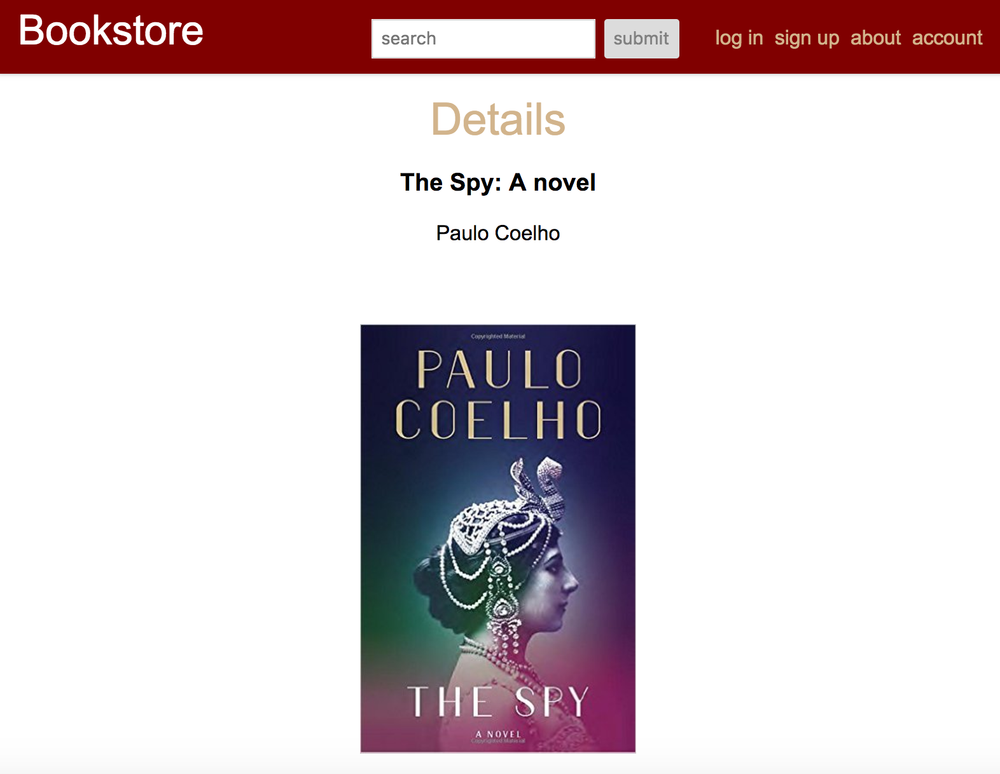

# Bookstore
A bookstore app built with PostgreSQL, Express and React.




## Install and Run App


### Run frontend

After cloning down the app to your computer navigate to the projects root directory in your CLI and run the following commands:

```
  $ npm install
```
To run the frontend, do the following in the projects main root directory:

```
  $ webpack
  $ webpack-dev-server
```
### Run backend

You will also need to run the backend server.
To get the backend setup correctly run the following commands once inside the backend folder:

```
  $ npm install
  $ npm run create:db
  $ npm run reset:db
```
To run the backend:

```
 $ npm start
```
See the app running on http://localhost:8080
